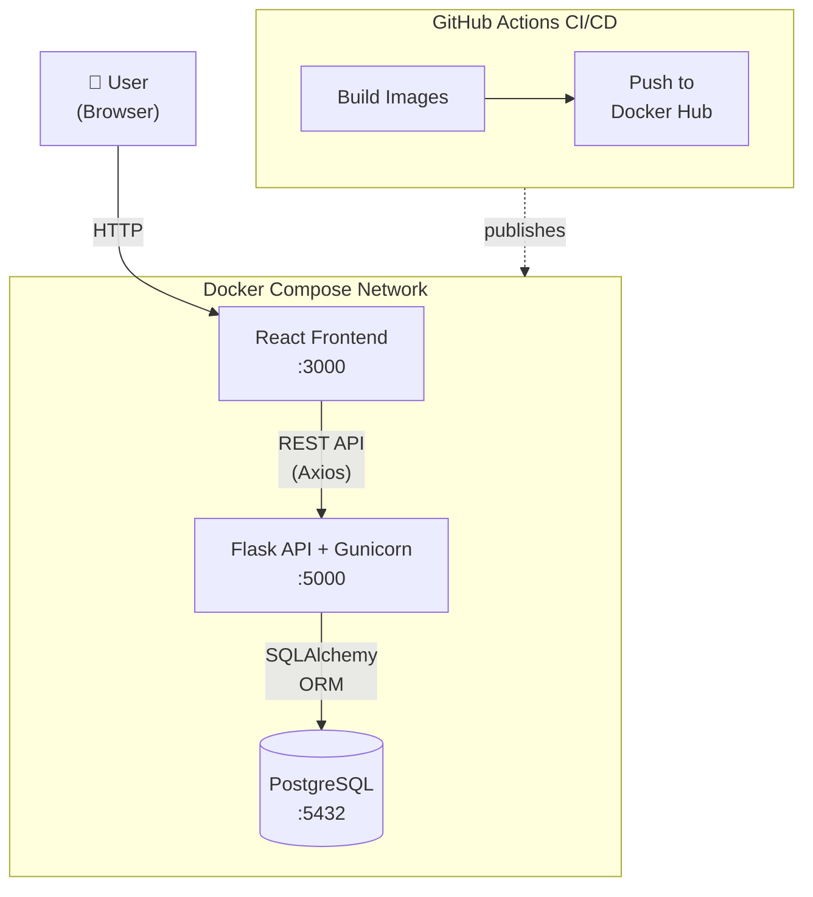
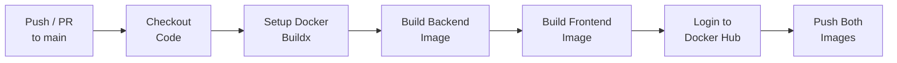

# Task Manager – Full-Stack App with CI/CD

[](https://github.com/JyothiKumar37/Task-manager-ci-cd/actions)
[]()
[](https://github.com/JyothiKumar37/Task-manager-ci-cd/blob/main/LICENSE)

A full-stack **Task Manager** application built with **React**, **Flask**, and **PostgreSQL**, fully containerized using **Docker Compose** with automated CI/CD via **GitHub Actions**. Users can create, view, and delete tasks through a clean web interface backed by a RESTful API and persistent database storage.

---

## Architecture



---

## Tech Stack

| Layer | Technology |
|-------|-----------|
| **Frontend** | React, Axios |
| **Backend** | Flask, SQLAlchemy, Gunicorn |
| **Database** | PostgreSQL 13 |
| **Containerization** | Docker, Docker Compose |
| **CI/CD** | GitHub Actions |
| **Registry** | Docker Hub |

---

## Repository Structure

```
Task-manager-ci-cd/
├── .github/
│   └── workflows/
│       └── ci-cd.yaml              # GitHub Actions pipeline
├── backend/
│   ├── app.py                      # Flask application entry
│   ├── requirements.txt            # Python dependencies
│   ├── wait-for-db.sh              # Database readiness script
│   └── Dockerfile                  # Backend container image
├── frontend/
│   ├── src/                        # React source code
│   ├── package.json                # Node.js dependencies
│   └── Dockerfile                  # Frontend container image
├── docker-compose.yaml             # Multi-service orchestration
├── .env                            # Environment variables
└── README.md
```

---

## Quick Start

### Prerequisites

- [Docker](https://docs.docker.com/get-docker/) & [Docker Compose](https://docs.docker.com/compose/install/) installed
- (Optional) Node.js for local frontend development

### Setup & Run

```bash
# 1. Clone the repository
git clone https://github.com/JyothiKumar37/Task-manager-ci-cd.git
cd Task-manager-ci-cd

# 2. Create environment file
cp .env.example .env
# Edit .env with your database credentials

# 3. Build and start all services
docker-compose up --build

# 4. Access the application
# Frontend:  http://localhost:3000
# Backend:   http://localhost:5000/tasks
```

| Service | URL | Description |
|---------|-----|------------|
| Frontend | `http://localhost:3000` | React web interface |
| Backend API | `http://localhost:5000/tasks` | Flask REST API |
| PostgreSQL | `localhost:5432` | Database (internal) |

---

## Environment Variables

Create a `.env` file in the project root with the following:

| Variable | Description | Example |
|----------|------------|---------|
| `POSTGRES_USER` | PostgreSQL username | `admin` |
| `POSTGRES_PASSWORD` | PostgreSQL password | `secretpassword` |
| `POSTGRES_DB` | Database name | `taskmanager` |
| `REACT_APP_API_URL` | Backend API URL for frontend | `http://localhost:5000/tasks` |

---

## CI/CD Pipeline

The GitHub Actions workflow triggers on every **push** and **pull request** to `main`, automating the build and publish process:



| Stage | Description |
|-------|------------|
| **Checkout** | Pulls the latest source code |
| **Docker Buildx** | Sets up multi-platform build support |
| **Build Backend** | Builds `task-manager-backend` Docker image |
| **Build Frontend** | Builds `task-manager-frontend` Docker image |
| **Push** | Tags and pushes both images to Docker Hub as `latest` |

### Published Images

| Image | Docker Hub |
|-------|-----------|
| Backend | `rockybhai37/task-manager-backend:latest` |
| Frontend | `rockybhai37/task-manager-frontend:latest` |

---

## API Endpoints

| Method | Endpoint | Description |
|--------|----------|------------|
| `GET` | `/tasks` | Retrieve all tasks |
| `POST` | `/tasks` | Create a new task (JSON body: `title`, `status`) |
| `DELETE` | `/tasks/<id>` | Delete a task by ID |

### Example Request

```bash
# Create a task
curl -X POST http://localhost:5000/tasks \
  -H "Content-Type: application/json" \
  -d '{"title": "Deploy to production", "status": "pending"}'

# Get all tasks
curl http://localhost:5000/tasks

# Delete a task
curl -X DELETE http://localhost:5000/tasks/1
```

---

## GitHub Secrets

Configure the following repository secrets for CI/CD:

| Secret | Description |
|--------|------------|
| `DOCKER_HUB_USERNAME` | Docker Hub username |
| `DOCKER_HUB_PASSWORD` | Docker Hub password or access token |

---

## Database Readiness

The backend uses a custom `wait-for-db.sh` entrypoint script that polls PostgreSQL on port `5432` using `netcat` before starting Gunicorn. This ensures the Flask application only starts after the database is fully ready to accept connections.

```bash
# wait-for-db.sh flow
Wait for PostgreSQL (nc -z db 5432) → Start Gunicorn on 0.0.0.0:5000
```

---

## Future Improvements

- [ ] Multi-stage Docker builds to reduce image size
- [ ] Run containers as non-root user for security
- [ ] Kubernetes deployment with Helm charts
- [ ] Trivy image vulnerability scanning in CI pipeline
- [ ] Automated unit and integration tests in pipeline
- [ ] Terraform for infrastructure provisioning
- [ ] Nginx reverse proxy for production deployment
- [ ] Health check endpoints and Docker HEALTHCHECK

---

## Author

**Pasupula Jyothi Kumar Reddy**

[](https://www.linkedin.com/in/pasupula-jyothi-kumar-reddy-211481209)

DevOps Engineer | Docker | Kubernetes | Terraform | AWS | Jenkins | GitHub Actions

---

## License

This project is licensed under the [MIT License](LICENSE).

